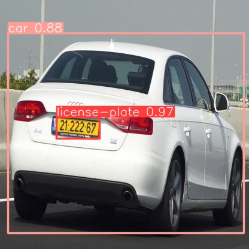
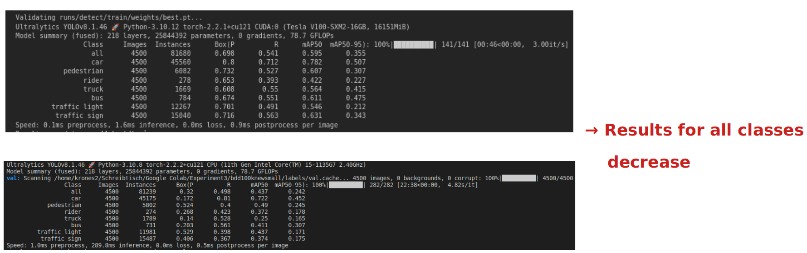

# Object-Detection-BDD100K

Coding folders (master):  
    1. Dataset_Scripts -> prepare BDD100K dataset and license plate dataset
    2. Colab_Notebooks -> train YOLOv8 (nano and medium) on BDD100K and license plate dataset
    3. Cluster_Notebooks -> compare inference speed YOLOv8 nano and Detectron2

Source datatsets:  
     BDD100K: http://bdd-data.berkeley.edu/download.html  
     -> Detection 2020 (Labels)  
     License plate: https://public.roboflow.com/object-detection/license-plates-us-eu
     

          
     

     

# 1. Scripts dataset:  
**1.1 convert_to_yolo.py:**  
convert labels from BDD100K format (JSON-File) into YOLO format (txt file for each image). Normalize the coordinates from the bounding boxes and check borders.      
**1.2 split_dataset.py:** 
This script takes a large dataset (BDD100K) of images and corresponding labels in YOLO format and splits it into a smaller subset, dividing it into training, validation, and test sets according to specified ratios. It then copies the selected images and their corresponding label files into their respective directories within the output directory for each set.     
**1.3 plot_yolo_labels.py:**  
This script visualizes ground truth bounding boxes on images with YOLO format annotations. It loads images along with their corresponding ground truth annotation files, plots bounding boxes with class labels, and displays them. The class names and colors for visualization are predefined, and the script allows for customization by selecting specific classes to plot.   
   
**1.4 convert_LicensePlate_labels.py:**   
This script converts label (.txt) files so that the labels match the format expected by the BDD100K dataset. It iterates through all text files in the specified directory, reads their contents, and modifies the class numbers accordingly. Specifically, it replaces class 0 with 7 and class 1 with 2. Finally, it writes the modified lines back to the files.    
**1.5 plot_original_bdd100k.py:**    
This script visualizes bounding boxes on images using data from a JSON file containing image information, including labels. It randomly selects five images from the JSON data and draws bounding boxes on them, with each box representing a detected object along with its category. The color of each box corresponds to the category of the detected object, and a legend is provided to identify each category. Additionally, the script allows for the visualization of bounding boxes on a specified image by providing its path.  
**1.6 check_frequency_distribution_classes.py:**  
These scripts analyze the frequency of classes in a dataset by counting the occurrences of each class label.   
**1.7 list_classes.py:**
This script lists the classes in the dataset and visualizes them using bounding boxes on images. It utilizes a Pandas DataFrame to organize class counts for each image and then displays the images with the most objects per class. Additionally, it filters the DataFrame to only keep rows where there is at least one object in the 'train' class and visualizes these images as well. Finally, it prints the DataFrame with filtered rows and displays the corresponding images with bounding boxes.    
**1.8 count_images.py:**  
Count the number of images in each split.

# 2. Train YOLO (Google Colab Notebooks):
**2.1 Train YOLOv8 nano pretrained 15/30 episodes:**  
**dataset:** 30.000 random images from 70.000:70 percent training (21.000), 15 percent validation (4.500), 15 percent test (4.500).  
Due to the unbalanced number of classes, I decided to only train YOLO in the following classes:  

  

  

The Confusion matrix 15 epoch training can be seen here:

  

**2.2 Train YOLOv8 nano pretrained with BDD100K and then license plate dataset to add class (license plates):**  
Confusion Matrix BDD100K dataset:  

  

  

Confusion Matrix license plate dataset:    

  

  

After the model was trained again with the license plate data set, it forgot how to predict the other classes. These classes were only very rarely recognized correctly. **What is interesting is that even the Cars class has lost accuracy even though there are cars in the pictures in the license data set.**  
The result on the validation data shows that there has been a degradation across all classes

  

A problem becomes clear here: the network cannot distinguish between license plates and texts on traffic signs. The street sign class seems to have been completely forgotten. What's strange to me is that classes like traffic lights are usually no longer recognized.  

  

# 3. Speed test inference time: Detectron2 and YOLO (Cluster Notebooks)
In the following, the accuracy of the models will not be taken into account. Only the inference speed between the trained models should be analyzed. It can be seen that YOLO nano has a 7.8 higher FPS rate. In future applications such as autonomous driving, it is of considerable importance to have enormous inference speed while maintaining accuracy.  

  

.
